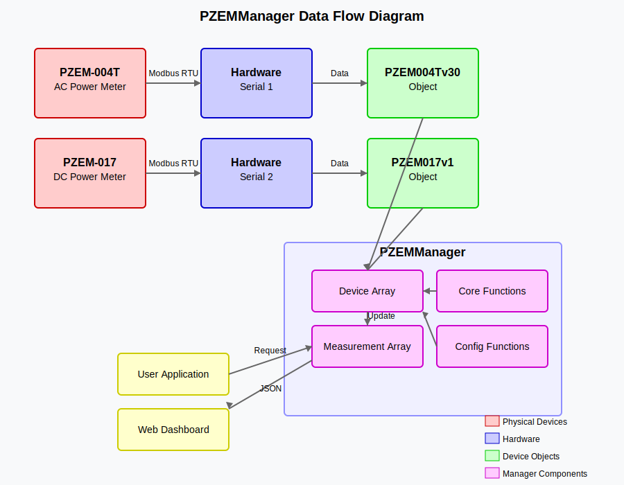

# Wiring Instructions: PZEM-004T and PZEM-017 with ESP32

This guide provides detailed instructions for wiring both PZEM-004T-V3.0 (AC power meter) and PZEM-017 (DC power meter) to an ESP32 controller.

## Hardware Requirements

- ESP32 development board
- PZEM-004T-V3.0 module
- PZEM-017 module
- Current transformer (CT) for PZEM-004T-100A (if using the 100A version)
- Appropriate shunt resistor for PZEM-017 (based on your current range)
- TTL to UART converter or level shifter (3.3V to 5V) if needed
- Jumper wires
- Power sources for testing

## PZEM-004T-V3.0 (AC Power Meter) Connections

### TTL Communication Connections to ESP32

| PZEM-004T Pin | ESP32 Pin | Description |
|---------------|-----------|-------------|
| 5V            | 5V        | Power supply for TTL interface |
| RX            | GPIO 17   | TX from ESP32 to PZEM-004T |
| TX            | GPIO 16   | RX from PZEM-004T to ESP32 |
| GND           | GND       | Ground |

**Note:** The TTL interface of PZEM-004T requires a 5V power supply. If your ESP32 cannot provide enough current on its 5V pin, use an external 5V source.

### Power Line Connections

**For PZEM-004T-10A (with built-in shunt):**

1. Connect the AC line (L) input to the L input terminal of the PZEM-004T
2. Connect the AC neutral (N) input to the N input terminal
3. Connect the load L output to the L output terminal
4. Connect the load N output to the N output terminal

**For PZEM-004T-100A (with external CT):**

1. Connect the AC line (L) input to the L terminal
2. Connect the AC neutral (N) input to the N terminal
3. Place the current transformer around the L wire to the load
4. Connect the CT terminals to the PZEM-004T CT terminals

## PZEM-017 (DC Power Meter) Connections

### TTL Communication Connections to ESP32

| PZEM-017 Pin | ESP32 Pin | Description |
|--------------|-----------|-------------|
| 5V           | 5V        | Power supply for TTL interface |
| RX           | GPIO 19   | TX from ESP32 to PZEM-017 |
| TX           | GPIO 18   | RX from PZEM-017 to ESP32 |
| GND          | GND       | Ground |

### Power Line Connections

The PZEM-017 connections depend on the chosen shunt:

1. Connect the DC positive input to the VCC+ terminal
2. Connect the DC negative input to the VCC- terminal
3. Connect the load positive to the OUT+ terminal
4. Connect the load negative to the OUT- terminal

If using an external shunt:
1. Connect the shunt across the appropriate terminals according to its rating

## Level Shifter (Optional)

The ESP32 uses 3.3V logic while PZEM modules use 5V logic for the TTL communication. While this often works

# PZEM Manager Library documentation guide


A comprehensive ESP32 library for unified management of PZEM-004T (AC) and PZEM-017 (DC) power monitoring modules.

## Contents

- [Overview](#overview)
- [Library Architecture](#library-architecture)
- [Installation](#installation)
- [Hardware Setup](#hardware-setup)
- [Basic Usage](#basic-usage)
- [Advanced Features](#advanced-features)
- [Web Dashboard](#web-dashboard)
- [Examples](#examples)
- [API Reference](#api-reference)
- [Troubleshooting](#troubleshooting)
- [License](#license)

## Overview

The PZEM Manager Library is designed to simplify the integration of both PZEM-004T (AC power meter) and PZEM-017 (DC power meter) devices with ESP32 microcontrollers. It provides a unified interface for accessing various power monitoring features while handling the underlying differences between the AC and DC modules.

### Key Features

- **Unified API**: Manage both AC and DC power meters through a consistent interface
- **Multi-device Support**: Control up to 10 PZEM devices from a single ESP32
- **JSON Output**: Ready for web interfaces with built-in JSON generation
- **Device Configuration**: Easily set parameters such as addresses and alarm thresholds
- **Detailed Measurements**: Access voltage, current, power, energy, and more
- **Custom Naming**: Assign meaningful IDs and names to your devices

## Library Architecture

The library consists of the following components:

### 1. Core Library Files

- **PZEMManager.h**: Header file defining the interfaces, structures, and class declarations
- **PZEMManager.cpp**: Implementation of all library functionality

### 2. Dependencies

- Original PZEM004Tv30 library by Jakub Mandula
- Original PZEM017v1 library by Maxz Maxzerker
- ArduinoJson library for JSON formatting

### 3. Primary Data Structures

- **PZEMDevice**: Represents a connected power monitoring device
- **PZEMMeasurement**: Holds measurement data from any PZEM device
- **PZEMManager**: Main class that manages all devices and provides the API

## Installation

1. **Download**: Clone or download this repository
2. **Install Dependencies**: Ensure ArduinoJson is installed via Library Manager
3. **Copy Library**: Place the PZEM Manager library files in your Arduino libraries folder:
   ```
   Documents/Arduino/libraries/PZEMManager/
   ```
4. **Include Library**: Add the library to your sketch:
   ```cpp
   #include "PZEMManager.h"
   ```

## Hardware Setup

### Components Needed

- ESP32 development board
- PZEM-004T-V3.0 module (for AC measurements)
- PZEM-017 module (for DC measurements)
- Current transformer (for PZEM-004T-100A)
- Appropriate shunt resistor (for PZEM-017)
- Jumper wires

### Design Flowchart and  Diagrams
 Below are three different flowcharts that provide comprehensive visualization of the PZEMManager library from different perspectives:
#### 1. PZEMManager Library Architecture Flowchart
This flowchart provides an overall view of the library architecture, showing:

- How the user application interacts with the PZEMManager library

- The internal components of the library and their relationships
  
- The flow of data from hardware devices through the software layers
  
- The different types of devices and their specific functionality
  
- Configuration methods and how they relate to different device types

The chart is organized into logical sections (user application, library core, device communication, and output formats) to help visualize how the components work together.


#### 2. PZEMManager Data Flow Diagram
This flowchart focuses specifically on how data moves through the system:

- Shows the physical devices and their connection to the ESP32 hardware
- Illustrates how the device objects communicate with the physical hardware
- Demonstrates the flow of measurement data through the library components
- Highlights how user applications interact with the library to get and process data
- Shows configuration paths and how they affect device settings


This diagram uses color coding to distinguish between physical components, hardware interfaces, software objects, manager components, and application logic.
Refer to the detailed wiring instructions document above for complete setup information.
### 3. PZEMManager Sequence Diagram
This diagram shows the temporal sequence of operations in the library:
- Details the initialization process for both device types
- Illustrates a complete configuration example (setting power alarm)
- Shows the complete read sequence for retrieving measurements
- Demonstrates how JSON data is generated
- Highlights the interaction between each component during these operations

This sequence diagram is particularly useful for understanding the order of operations and communication between components.
Together, these three diagrams provide a comprehensive view of the PZEMManager library from structural, data flow, and temporal perspectives, giving both developers and users a clear understanding of how the system works.

## Basic Usage

### Initialization

```cpp
#include "PZEMManager.h"

// Create serial ports
HardwareSerial Serial1(1);  // UART1 for PZEM-004T
HardwareSerial Serial2(2);  // UART2 for PZEM-017

// Create PZEM manager
PZEMManager pzemManager;

void setup() {
  // Initialize AC meter (PZEM-004T)
  Serial1.begin(9600, SERIAL_8N1, 16, 17);  // RX, TX pins
  pzemManager.addPZEM004T(1, Serial1, 16, 17, 0x01, "Main AC Supply");
  
  // Initialize DC meter (PZEM-017)
  Serial2.begin(9600, SERIAL_8N1, 18, 19);  // RX, TX pins
  pzemManager.addPZEM017(2, Serial2, 0x01, "Solar DC System");
}
```

### Reading Measurements

```cpp
void loop() {
  // Read AC meter
  PZEMMeasurement acMeasurement = pzemManager.getMeasurement(1);
  if (acMeasurement.isValid) {
    Serial.printf("AC: %.1fV, %.3fA, %.1fW, %.3fkWh\n",
                 acMeasurement.voltage,
                 acMeasurement.current,
                 acMeasurement.power,
                 acMeasurement.energy);
  }
  
  // Read DC meter
  PZEMMeasurement dcMeasurement = pzemManager.getMeasurement(2);
  if (dcMeasurement.isValid) {
    Serial.printf("DC: %.1fV, %.3fA, %.1fW, %.3fkWh\n",
                 dcMeasurement.voltage,
                 dcMeasurement.current,
                 dcMeasurement.power,
                 dcMeasurement.energy);
  }
  
  delay(5000);
}
```

### JSON Output

```cpp
void printAllDevicesAsJSON() {
  String json = pzemManager.getAllMeasurementsJSON();
  Serial.println(json);
}
```

## Advanced Features

### Setting Alarm Thresholds

```cpp
// Set power alarm for PZEM-004T (in watts)
pzemManager.setPowerAlarm(1, 2000);  // 2000W threshold

// Set voltage alarms for PZEM-017 (in 0.01V units)
pzemManager.setHighVoltageAlarm(2, 3000);  // 30.00V high threshold
pzemManager.setLowVoltageAlarm(2, 1000);   // 10.00V low threshold
```

### Configuring Shunt Type (PZEM-017)

```cpp
// Configure shunt type for PZEM-017
// 0: 100A shunt, 1: 50A shunt, 2: 200A shunt, 3: 300A shunt
pzemManager.setShuntType(2, 0);  // 100A shunt
```

### Resetting Energy Counters

```cpp
// Reset energy counter for a specific device
pzemManager.resetEnergy(deviceId);
```

### Changing Device Address

```cpp
// Change the Modbus address of a device
pzemManager.setAddress(deviceId, newAddress);
```

## Web Dashboard

The library includes an HTML/JavaScript dashboard for visualizing power measurements in a web browser:

### Features

- Real-time display of all device measurements
- Historical data visualization with charts
- Alarm status indicators
- Energy usage statistics
- Mobile-responsive design

### Integration

1. Upload the dashboard HTML to your ESP32 using SPIFFS
2. Set up a web server on the ESP32
3. Configure your ESP32 to send measurement data in JSON format
4. Access the dashboard via your ESP32's IP address

## Examples

The library includes several example sketches:

1. **Basic_Reading**: Simple example of reading from both meter types
2. **Multiple_Devices**: Managing multiple PZEM devices
3. **Web_Server**: Setting up a web server with the dashboard
4. **MQTT_Integration**: Publishing measurements to an MQTT broker
5. **Data_Logging**: Saving measurements to an SD card

## API Reference

### Main Classes and Methods

#### PZEMManager Class

- **addPZEM004T**: Add a PZEM-004T device
- **addPZEM017**: Add a PZEM-017 device
- **getMeasurement**: Get measurements from a specific device
- **getAllMeasurements**: Get all measurements as an array
- **getMeasurementJSON**: Get JSON-formatted measurements for a device
- **getAllMeasurementsJSON**: Get all measurements in JSON format
- **setAddress**: Change a device's Modbus address
- **resetEnergy**: Reset energy counter for a device
- **setPowerAlarm**: Set power alarm threshold (PZEM-004T)
- **setHighVoltageAlarm**: Set high voltage alarm (PZEM-017)
- **setLowVoltageAlarm**: Set low voltage alarm (PZEM-017)
- **setShuntType**: Configure shunt type (PZEM-017)

#### PZEMMeasurement Structure

- **voltage**: Voltage in volts
- **current**: Current in amps
- **power**: Power in watts
- **energy**: Energy in kilowatt-hours
- **frequency**: Frequency in hertz (AC only)
- **pf**: Power factor (AC only)
- **highVoltAlarm**: High voltage alarm status (DC only)
- **lowVoltAlarm**: Low voltage alarm status (DC only)
- **powerAlarm**: Power alarm status (AC only)
- **isValid**: Indicates if the measurement is valid

## Troubleshooting

### Common Issues

1. **No Communication**:
   - Verify wiring connections
   - Check that TX/RX pins are correctly specified
   - Ensure correct device addresses are used

2. **Invalid Readings**:
   - Check power supply to the PZEM modules
   - Verify shunt type for PZEM-017
   - Ensure proper grounding

3. **ESP32 Crashes**:
   - Reduce polling frequency
   - Check for memory leaks
   - Verify serial buffer sizes

### Debugging Tips

- Enable debug output in PZEMManager.h
- Use Serial Monitor to watch communication
- Verify correct baud rate (9600 for PZEM devices)

## License

This library is released under the MIT License. See the LICENSE file for details.

---

## Acknowledgments

- Based on the original PZEM004Tv30 library by Jakub Mandula
- PZEM017v1 library by Maxz Maxzerker
- Thanks to the ESP32 and Arduino communities

## Support & Contributions

Contributions to improve this library are welcome. Please submit issues, feature requests, or pull requests on the GitHub repository.

For questions and support, please open an issue on the GitHub repository.

---

Last updated: April 2025
